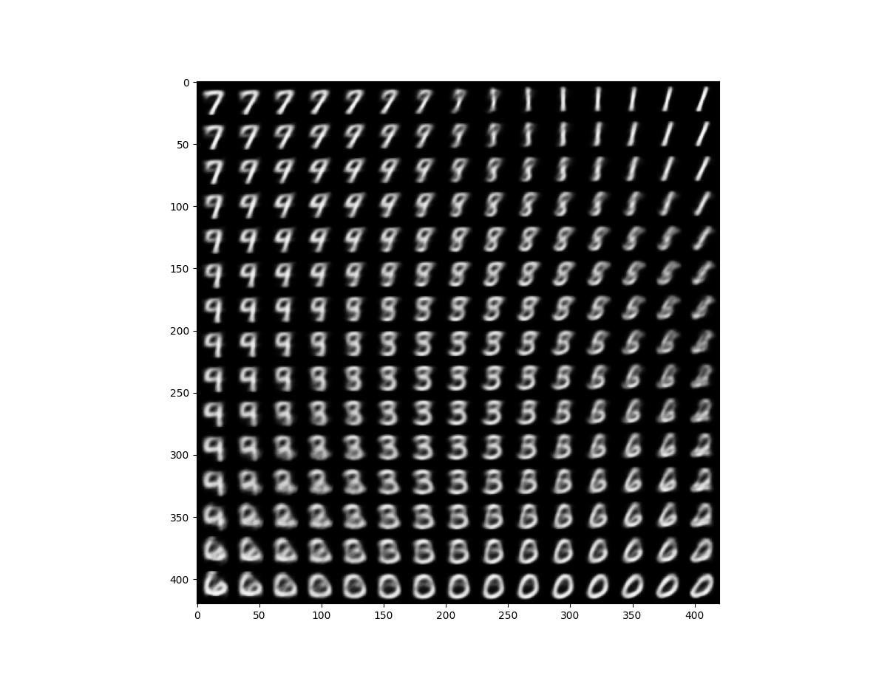
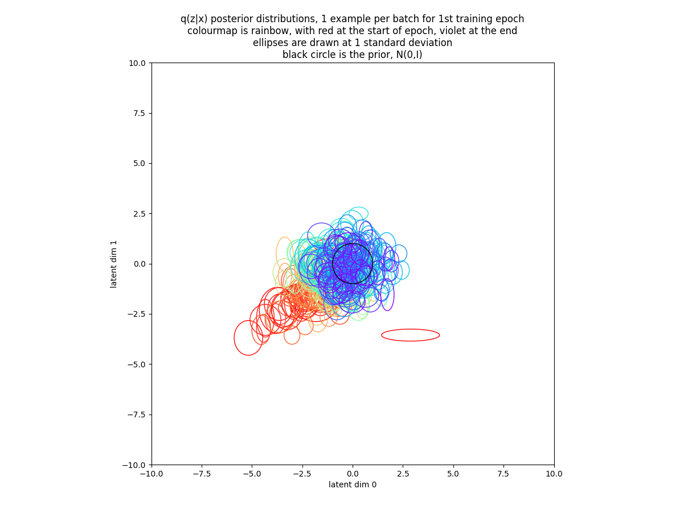
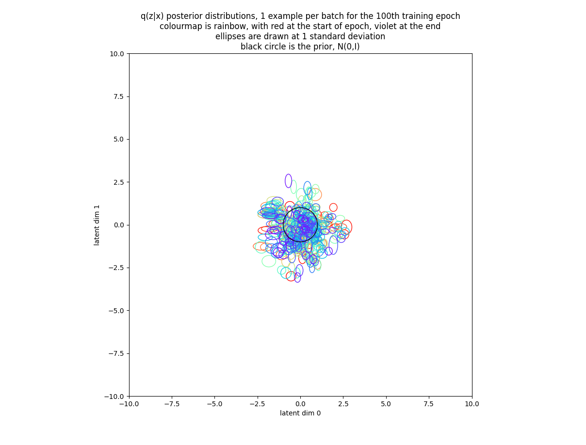
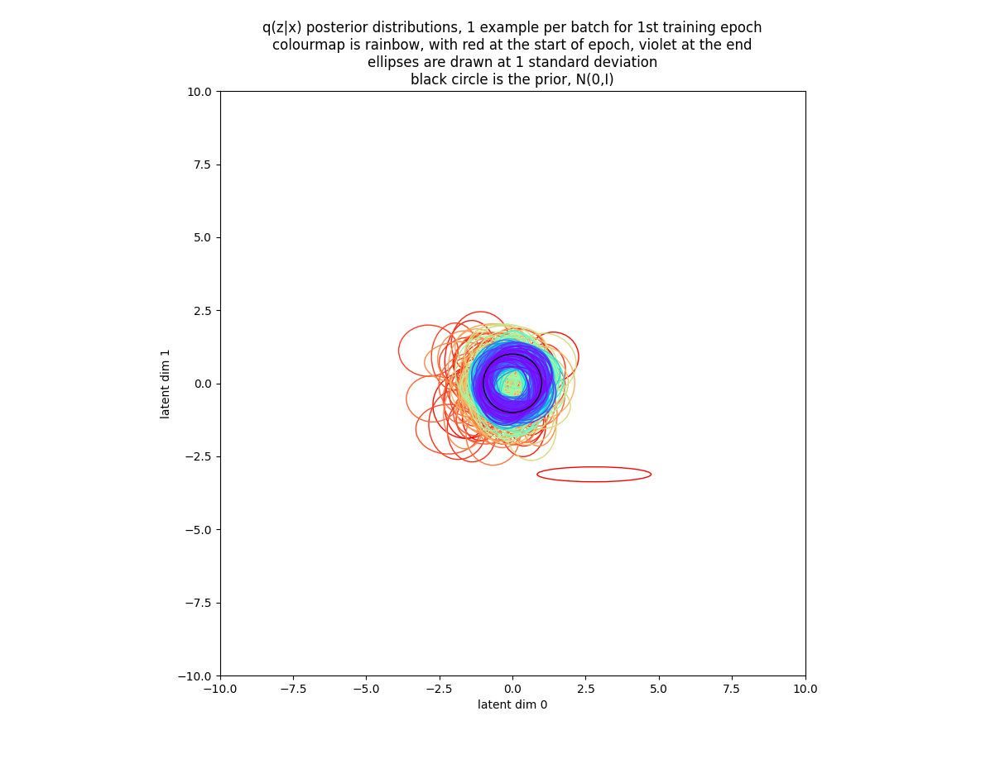
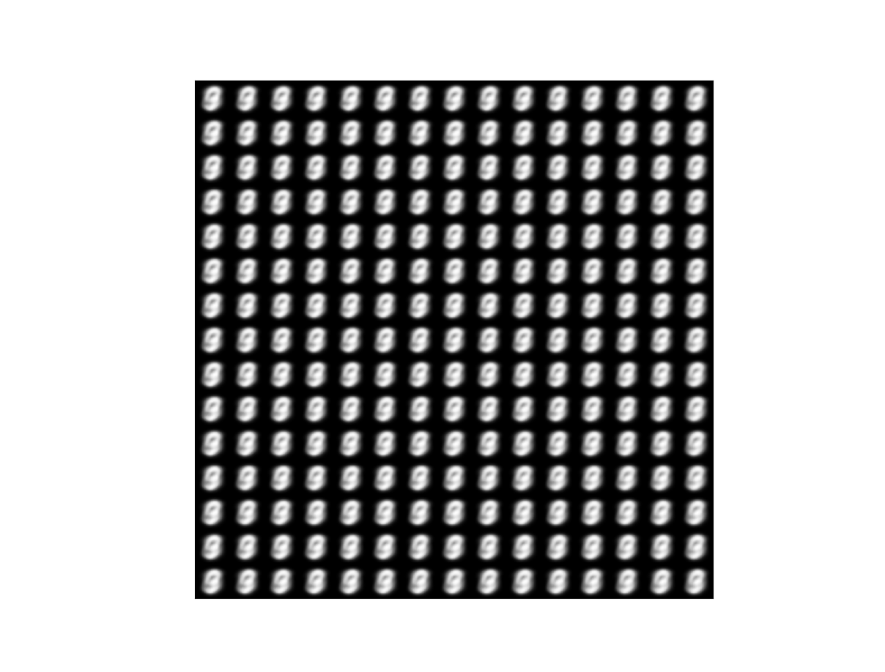

# Variational Auto-Encoder
<B>Implementation</B>

This code began life as a tutorial in Francois Chollet's book <a href=https://www.amazon.co.uk/Deep-Learning-Python-Francois-Chollet/dp/1617294438/>Deep Learning with Python, 2018</a>.  I modified that code to follow <a href=https://arxiv.org/abs/1312.6114>Kingma and Welling, 2013</a>, replacing Chollet's convolutional networks with the original dense networks.  I then converted the code from using the Keras Functional API to use class-based custom-layers.  I then introduced Kullback Leibler annealing as described in <a href=https://arxiv.org/abs/1804.02135>Akuzawa, et al, 2018</a> (originally in <a href=https://arxiv.org/abs/1511.06349>Bowman, et al, 2016</a>), and L2 weight regularization as used by Kingma and Welling.  Finally, I modified the code to return posterior distribution parameters to a custom training loop so I could plot posterior distributions as the model trained.  I think my code is now sufficiently different from Chollet's tutorial that I can post it here in <a href=vae.py>vae.py</a>.

As in Chollet's tutorial the model was trained on the MNIST digit dataset and used to generate digit images from latent samples chosen within roughly 1.6 standard deviations of the prior mean over a 2 dimensional latent space.  I found neither Kullback Leibler annealing, which slowly increases the weight of the Kullback Leibler loss term over training steps, nor L2 weight regularization, to be helpful on this task.  Rather, I found that a fixed Kullback Leibler weight, the kl_wt hyperparamter in my code, specifying how much weight the Kullback Leibler loss received relative to the decoder cross-entropy loss was helpful.  Experiment showed that the best value of this hyperparameter, where best means generating a digit image containing a large variety of sharply defined digits, was approximately 1e-3 (and this was the value implicit in Chollet's tutorial).

The generated digit image using kl_wt=1e-3 looks like this :

The Kullback Leibler loss term acts to encourage the posterior distribution q(z|x) to look like the prior p(z) = N(0,I).  I was interested to see what the posterior distributions actually looked like both during training and at the end of training under various different kl_wt hyperparameter values.  I therefore modified my code to return encoded posterior distribution parameters during training so they could be plotted.  For clarity I restricted my plots to the 1st training example per batch over a single epoch, resulting in 469 examples per plot.  I used a rainbow colourmap to indicate batch number, with red at the start of the epoch, through orange, yellow, green, blue, and indigo, to violet at the end of the epoch.  I plotted a 1 standard deviation ellipse for every q(z|x) normal distribution in latent space, plus a black circle to represent the prior N(0,I).

The posterior distributions over the 1st training epoch using kl_wt=1e-3 look like this:

As we can see, posterior distributions start mostly a long way from the origin (in red) and are dragged weakly towards it (violet) over the 1st epoch.  However, while posterior means approach the prior mean over the epoch, posterior variances appear to shrink getting further from the prior variance.  This tendancy is confirmed by looking at a similar plot produced from the 100th training epoch in which we see that posterior variances are now tiny, but virtually all posterior means are within 5 standard deviations of the origin: 

Increasing kl_wt by a factor of 10 to 1e-2 we find the generated digit image contains slightly fewer digits which are perhaps slightly fuzzier on average than those above:

The posterior distributions over the 1st training epoch can be seen to march much more convincingly towards the origin in latent space, with variances remaining relatively large compared to those seen above:

After 100 epochs we see that the stronger kl_wt has caused virtually all posterior means to lie within 2.5 standard deviations of the origin.  Posterior variances are still smaller than the prior variance, but not as small as when kl_wt was 1e-3:

These posteriors are consistent with the generated digit image : larger variances are consistent with each digit encoding into a larger region of latent space than before (hence fewer digits in the image) and overlapping more with its neigbours (hence fuzziness).

Increasing kl_wt by another factor of 10 to 1e-1 we find that the posterior distributions become very similar to the prior, both in mean and in variance, after just one epoch of training:

The posteriors are now so similar not only to the prior but also to each other that the VAE cannot effectively encode different digits into different regions of latent space and cannot decode different latent samples into different digits.  As a result, even after 100 epochs of training, all decoded latent samples look essentially the same :

TensorBoard training curves for the 3 cases given here are in <a href=TensorBoard1e-3.png>TensorBoard1e-3.png</a>, <a href=TensorBoard1e-2.png>TensorBoard1e-2.png</a> and <a href=TensorBoard1e-1.png>TensorBoard1e-1.png</a>.

