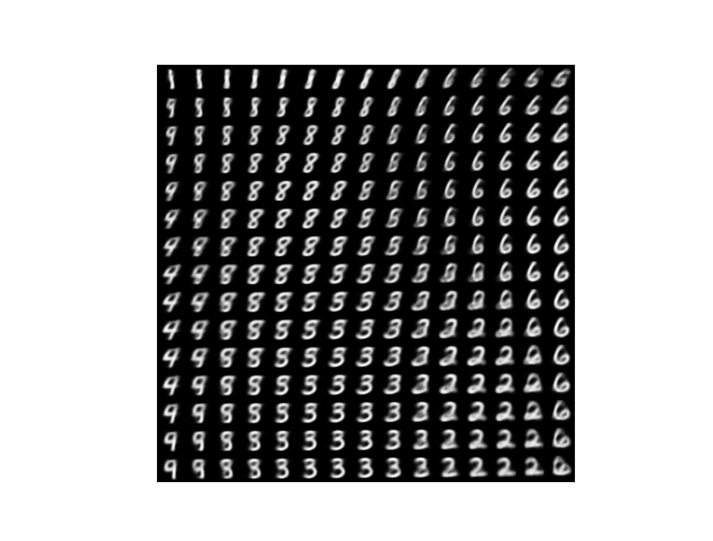
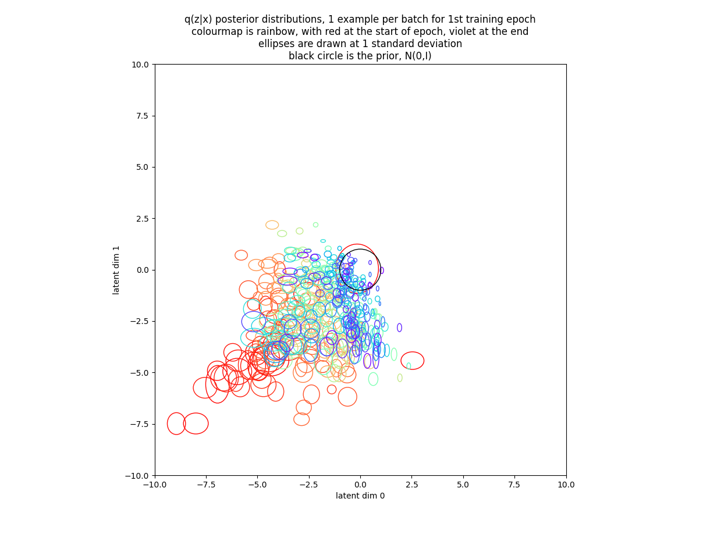
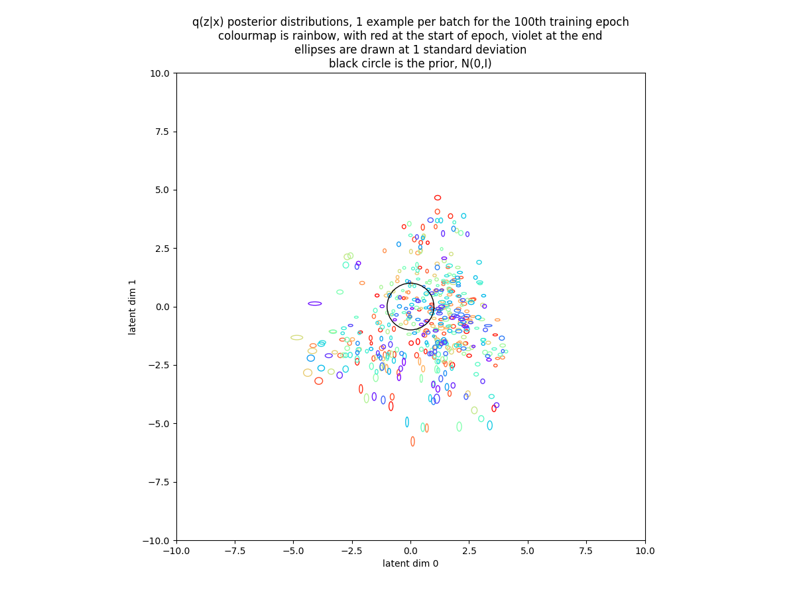

# VAE
Variational Autoencoder Implementation

under construction...

This code began life as a tutorial in Francois Chollet's book Deep Learning with Python, autoencoding the popular MNIST digit dataset.  I modified that code to follow <a href=https://arxiv.org/abs/1312.6114>Kingma and Welling, 2013</a>, replacing Chollet's convolutional networks with the original dense networks.  I then converted the code from using the Keras Functional API to use class-based custom-layers.  I then introduced Kullback Leibler Annealing as described in <a href=https://arxiv.org/abs/1804.02135>Akuzawa, et al, 2018</a> (originally in <a href=https://arxiv.org/abs/1511.06349>Bowman, et al, 2016</a>), and L2 weight regularization as used in Kingma and Welling.  Finally, I introduced a custom training loop so I could plot posterior distributions as the model trained.  I think my code is now sufficiently different from the original that I can post it here in <a href=vae.py>vae.py</a>.

I found neither Kullback Leibler Annealing, which slowly increases the weight of the Kullback Leibler loss term over training steps, nor L2 weight regularization, to be helpful on this task.  Rather, I found that a fixed Kullback Leibler weight, the kl_wt hyperparamter in my code, specifying how much weight the Kullback Leibler loss should receive relative to the p(x|z) cross-entropy loss, was helpful.  Experimentation showed that the best value of this hyperparameter, where best means generating a large variety of sharply defined digits within approximately 2 standard deviations of the prior mean over a 2 dimensional latent space, was approximately 1e-3 (and this is the value implicit in Chollet's original code).

The generated digit image using kl_wt=1e-3 looks like this :

The Kullback Leibler loss term acts to encourage the posterior distribution q(z|x) to look like the prior p(z) = N(0,I).  I was interested to see what the posterior distributions actually looked like both during training and at the end of training under various different kl_wt hyperparameters.  I therefore modified my code to return encoded posterior distribution parameters during training so they could be plotted.  For clarity I restricted my plots to the 1st training example per batch over a single epoch, resulting in 468 examples per plot.  I used a rainbow colourmap to indicate batch number, with red at the start of the epoch, through orange, yellow, green, blue, and indigo, to violet at the end of the epoch.  I plotted a 1 standard deviation ellipse for every q(z|x) normal distribution in latent space, plus a black circle to represent the prior N(0,I).

The posterior distributions over the 1st training epoch using kl_wt=1e-3 look like this:

As we can see, posterior distributions start mostly a long way from the origin (in red) and are dragged weakly towards it (violet) over the 1st epoch.  However, while posterior means approach the prior mean over the epoch, posterior variances appear to shrink getting further from the prior variance.  This tendancy is confirmed by looking at a similar plot produced from the 100th training epoch in which we see that posterior variances are now truly tiny, but virtually all posterior means are within 5 standard deviations of the origin: 

